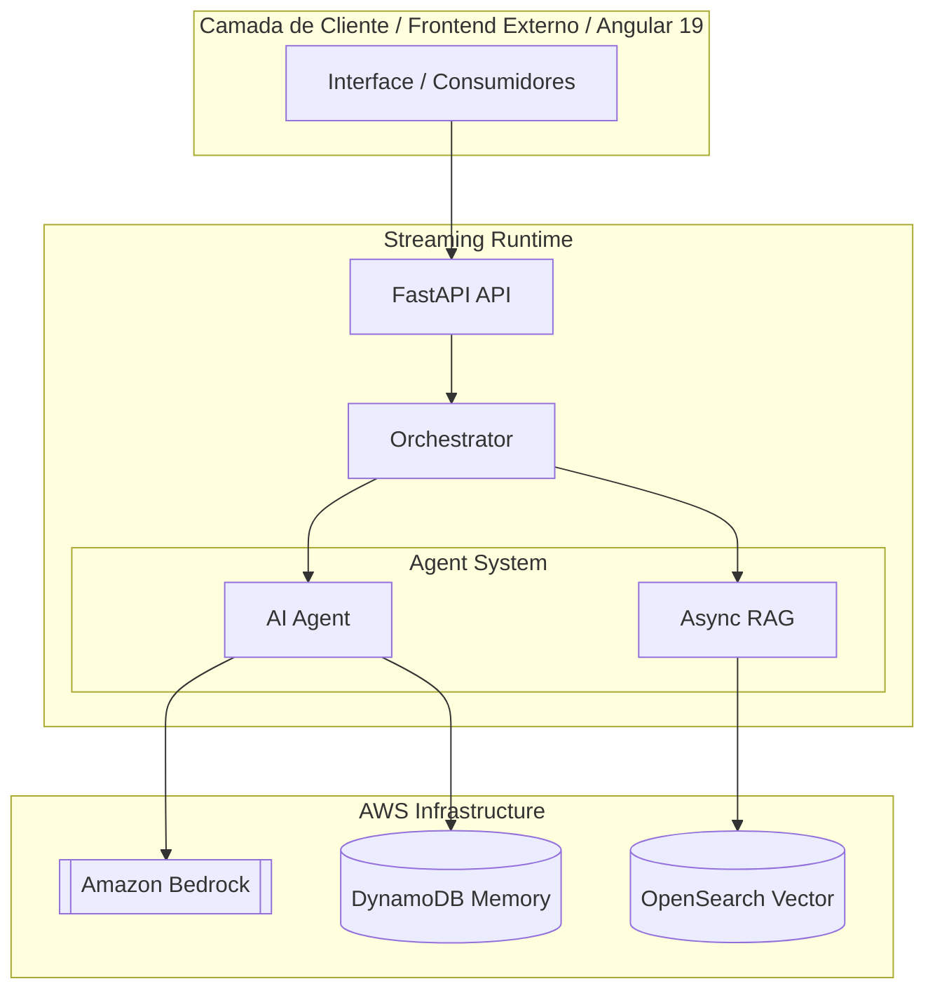

# TTYD — Talk To Your Data — LEVEL 19

AI Agent Platform with Real-Time Streaming Architecture.

---


---

## 🧠 Architecture Level 19

O **LEVEL 19** foca em **Observability & Tracing** com rastreamento ponta a ponta de requisições, correlação de logs assíncronos em threads e corrotinas via `contextvars` e instrumentação fina da latência de execução no FastAPI. Ele herda e complementa toda a segurança corporativa e segregação física estabelecidas no LEVEL 18.

---

## 🏗️ Estrutura do Projeto

```text
ttyd/
├── backend/            # API FastAPI + Agentes (Coração do Sistema)
│   ├── agents/         # Definições de Agentes e Ferramentas
│   ├── application/    # Casos de uso, RAG e serviços de Memória
│   ├── app_config/     # Configurações de módulos (Bedrock, DBs)
│   ├── core/           # Módulos core e esquemas comuns
│   ├── prompts/        # Gestão centralizada de Prompts
│   └── runtime/        # Motor de execução e orquestração
├── config/             # Metadados e definições globais do projeto
├── deploy/             # Docker Compose (dev/local)
├── scripts/            # Automação (README, Environments, Doctor)
├── security/           # Configurações de ambiente (.env.dev, .env.local)
├── terraform/          # Infraestrutura como Código (Provisionamento AWS Local/Dev)
├── tests/              # Suíte de testes (Mock e Real Integration)
├── Makefile            # Orquestrador de operações e deploy
├── pyproject.toml      # Manifesto de dependências (Poetry)
└── README.md           # Documentação mestre do projeto

```

---

## 🔄 Fluxo do Sistema (Mermaid)



---

## ⚙️ Ambientes

| Ambiente | AWS | Deploy | Objetivo | Status |
|----------|-----|--------|----------|--------|
| **dev** | Offline / Mock | Docker | Desenvolvimento sem custos AWS | ✅ Ativo |
| **local** | AWS Real | Docker | Validação integrada com Bedrock | ✅ Ativo |

---

## 🚀 Roadmap Evolutivo

O projeto segue uma jornada de evolução incremental por níveis:

```text
- LEVEL 17 → Streaming & Agent Runtime ✔️
- LEVEL 18 → Enterprise Security (Entra ID / IAM) ✔️
- LEVEL 19 → Observability & Tracing 🚀 (ATUAL)
- LEVEL 20 → Multi-Agent Cognitive Ecosystem
```

---

## 📌 Status do Projeto

### Arquitetura: **LEVEL 19 🚀 (Observability & Tracing - ATUAL)**

### Pronto para: **LEVEL 20 📈 (Multi-Agent Cognitive Ecosystem)**

---

## 👤 Autoria

- **Autores**: NTTData Squad Estratégia Digital e CRM
- **Organização**: NTT DATA
- **Versão**: 19.0.0
- **Gerado em**: 2026-05-31 22:15:01

---

## 📄 Licença

Projeto interno NTT DATA / Record. Consulte o time responsável pelo repositório para políticas de uso e contribuição.
