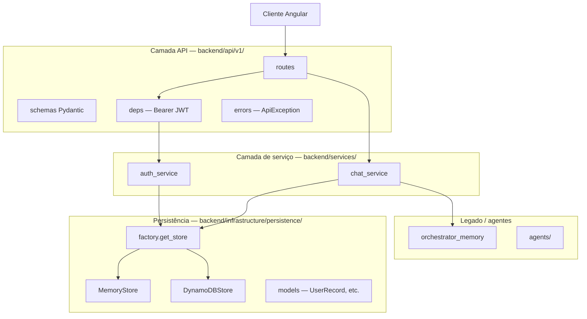
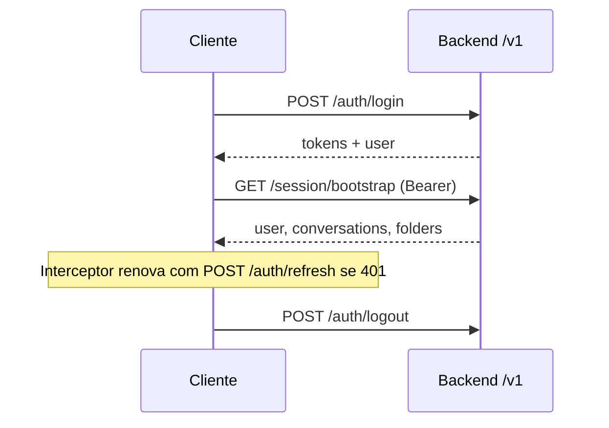
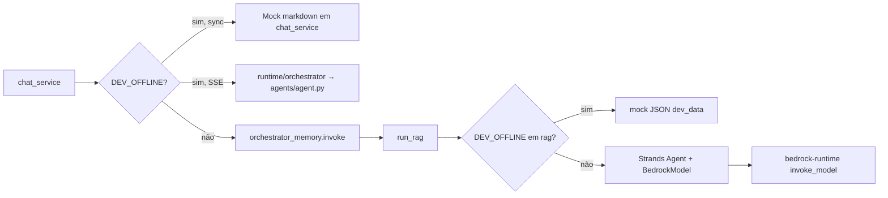

# Documentação do Backend — Talk to Your Data (TTYD)

**Versão da API:** 18.0.0  
**Base URL:** `http://localhost:8000`  
**Contrato front Angular:** API v1 em `/v1`  
**Última atualização:** maio/2026

---

## Índice

1. [Visão geral](#1-visão-geral)
2. [Arquitetura em camadas](#2-arquitetura-em-camadas)
3. [Estrutura de pastas](#3-estrutura-de-pastas)
4. [Entidades de domínio](#4-entidades-de-domínio)
5. [Persistência e repositórios](#5-persistência-e-repositórios)
6. [DynamoDB — modelo de tabelas](#6-dynamodb--modelo-de-tabelas)
7. [Serviços e regras de negócio](#7-serviços-e-regras-de-negócio)
8. [Autenticação JWT](#8-autenticação-jwt)
9. [Envelope de erro](#9-envelope-de-erro)
10. [Referência de endpoints](#10-referência-de-endpoints)
11. [Como testar](#11-como-testar)
12. [Variáveis de ambiente](#12-variáveis-de-ambiente)
13. [Rotas legadas](#13-rotas-legadas)
14. [Dados seed (dev)](#14-dados-seed-dev)
15. [Pipeline LLM, guardrails e apresentação por role](#15-pipeline-llm-guardrails-e-apresentação-por-role)

---

## 1. Visão geral

O backend é uma API **FastAPI** que expõe:

| Superfície | Prefixo | Uso |
|------------|---------|-----|
| **API v1** (contrato Angular) | `/v1` | Auth, conversas, mensagens, pastas, feedback, export |
| **Legado** | `/`, `/invoke`, `/chat` | Integrações antigas e testes rápidos |
| **Swagger** | `/docs`, `/openapi.json` | Documentação interativa |

**Persistência:**

- `DEV_OFFLINE=true` → repositório **em memória** (`MemoryStore`), com dados seed.
- `DEV_OFFLINE=false` → **DynamoDB** (`DynamoDBStore`); se a conexão falhar, faz fallback para memória.

**LLM / RAG:**

- Ponto de entrada do chat (API v1): `backend/services/chat_service.py` → `_generate_assistant_content()`.
- Offline (`DEV_OFFLINE=true`): resposta simulada no próprio `chat_service` (sync) ou stream fake em `runtime/orchestrator.py` (SSE).
- Online: `backend/application/orchestrator_memory.py` → `run_rag()` → agente **Strands** + **Amazon Bedrock** (`LLM_MODEL`).
- Após o LLM: **guardrails** (`response_guardrails.py`) e **máscara por role** (`response_presentation.py`) — ver [§15](#15-pipeline-llm-guardrails-e-apresentação-por-role).

---

## 2. Arquitetura em camadas



| Camada | Responsabilidade |
|--------|------------------|
| **Routes** | HTTP, validação de entrada, status codes, montagem de resposta |
| **Schemas** | Contrato JSON (request/response) alinhado ao front |
| **Deps** | Extrair usuário do JWT (`CurrentUser`) |
| **Services** | Regras de negócio, rate limit, integração LLM |
| **Persistence** | CRUD de usuários, pastas, conversas, mensagens, refresh tokens |
| **Models** | Registros internos (`dataclass`) |

---

## 3. Estrutura de pastas

```text
backend/
├── main.py                          # App FastAPI, CORS, handlers, rotas legadas
├── swagger_app.py                   # App alternativa (SageMaker /invocations)
├── api/
│   ├── v1/
│   │   ├── router.py                # Agrega todos os routers /v1
│   │   ├── deps.py                  # HTTPBearer, CurrentUser, paginação
│   │   ├── errors.py                # ApiException + handlers
│   │   ├── utils.py                 # slugify, epoch ms, mapeadores DTO
│   │   ├── schemas/                 # Pydantic (auth, user, conversation, message, folder)
│   │   └── routes/                  # auth, session, users, conversations, messages, folders, feedback, export
│   └── routes/                      # Legado: POST /chat (sem prefixo /v1)
├── services/
│   ├── auth_service.py              # Login, JWT, refresh, logout
│   ├── chat_service.py              # Mensagens, SSE, regenerate, rate limit, chamada LLM
│   ├── response_guardrails.py       # Validação pós-LLM (heurísticas)
│   └── response_presentation.py     # Máscara de números por role (user vs admin)
├── infrastructure/persistence/
│   ├── models.py                    # Entidades (dataclass)
│   ├── memory_store.py              # Repositório em memória + seed
│   ├── dynamodb_store.py            # Repositório DynamoDB
│   └── factory.py                   # get_store() — escolhe memória ou DynamoDB
├── application/                     # RAG, memória, orquestrador (LLM real)
├── agents/                          # Agentes e runtime (legado/stream)
└── app_config/settings.py           # Configuração por ambiente
```

---

## 4. Entidades de domínio

Definidas em `backend/infrastructure/persistence/models.py`.

### 4.1 `UserRecord`

| Campo interno | Campo API (`UserOut`) | Tipo | Descrição |
|---------------|----------------------|------|-----------|
| `id` | `id` | UUID | Identificador |
| `username` | `username` | string | Login |
| `password_hash` | — | string | Hash pbkdf2_sha256 (nunca exposto na API) |
| `display_name` | `displayName` | string | Nome na sidebar |
| `email` | `email` | string \| null | E-mail |
| `roles` | `roles` | string[] | Ex.: `["ttyd:user"]` |
| `tenant_id` | `tenantId` | string \| null | Multi-tenant / org para RAG |

### 4.2 `FolderRecord`

| Campo interno | Campo API (`FolderOut`) | Tipo | Descrição |
|---------------|------------------------|------|-----------|
| `id` | `id` | UUID | ID da pasta |
| `user_id` | — | string | Dono (isolamento por usuário) |
| `name` | `name` | string | Nome exibido |
| `slug` | `slug` | string | URL amigável (`/home/pastas/{slug}`) |
| `created_at` | `createdAt` | number | Epoch **ms** |
| `updated_at` | `updatedAt` | number | Epoch **ms** |
| — | `conversationsCount` | number | Opcional, calculado na listagem |

### 4.3 `ConversationRecord`

| Campo interno | Campo API (`ConversationSummary`) | Tipo | Descrição |
|---------------|----------------------------------|------|-----------|
| `id` | `id` | UUID | ID da conversa |
| `user_id` | — | string | Dono |
| `title` | `title` | string | Título na sidebar |
| `description` | `description` | string \| null | **Primeira pergunta** (não muda depois) |
| `last_updated_at` | `lastUpdatedAt` | number | Epoch **ms** |
| `folder_id` | `folderId` | UUID \| null | Pasta ou `null` |

### 4.4 `MessageRecord`

| Campo interno | Campo API (`ChatMessage`) | Tipo | Descrição |
|---------------|--------------------------|------|-----------|
| `id` | `id` | UUID | ID da mensagem |
| `conversation_id` | `conversationId` | UUID | Conversa pai |
| `user_id` | — | string | Dono |
| `role` | `role` | `"user"` \| `"assistant"` | Autor |
| `content` | `content` | string | Texto (markdown no assistente) |
| `created_at` | `createdAt` | number | Epoch **ms** |
| `status` | `status` | string | `pending`, `completed`, `failed` |
| `feedback` | `feedback` | `"like"` \| `"dislike"` \| null | Só em mensagens do assistente |

### 4.5 Refresh token (armazenamento)

| Campo | Tipo | Descrição |
|-------|------|-----------|
| `id` | string | SHA-256 do token bruto |
| `userId` | string | Usuário associado |
| `expiresAt` | number | Epoch ms |
| `ttl` | number | TTL DynamoDB (segundos) |

---

## 5. Persistência e repositórios

### 5.1 Factory

```python
# backend/infrastructure/persistence/factory.py
get_store() -> MemoryStore | DynamoDBStore
```

| Condição | Repositório |
|----------|-------------|
| `DEV_OFFLINE=true` | `MemoryStore` |
| `DEV_OFFLINE=false` e DynamoDB OK | `DynamoDBStore` |
| `DEV_OFFLINE=false` e falha AWS | Fallback `MemoryStore` |

### 5.2 Interface do repositório (métodos principais)

Ambos `MemoryStore` e `DynamoDBStore` implementam a mesma superfície:

| Método | Descrição |
|--------|-----------|
| `get_user_by_username(username)` | Login |
| `get_user(user_id)` | Perfil / validação JWT |
| `verify_password(user, password)` | Validação de senha |
| `list_folders(user_id)` | Pastas do usuário |
| `get_folder(user_id, folder_id)` | Por UUID |
| `get_folder_by_slug(user_id, slug)` | Por slug |
| `folder_name_exists(user_id, name, exclude_id?)` | Duplicidade |
| `create_folder(user_id, name)` | Gera slug único |
| `update_folder(folder, name)` | Renomeia + atualiza slug |
| `delete_folder(user_id, folder_id, cascade)` | Com ou sem exclusão de conversas |
| `list_conversations(user_id, folder_id?, q?)` | Lista + busca + filtro pasta |
| `get_conversation(user_id, conversation_id)` | Sempre valida `user_id` |
| `create_conversation(...)` | Nova conversa |
| `update_conversation(conv, **kwargs)` | Atualiza + `last_updated_at` |
| `delete_conversation(user_id, conversation_id)` | Remove mensagens associadas |
| `list_messages(conversation_id)` | Ordenado por `created_at` asc |
| `get_message(message_id)` | Por ID |
| `create_message(...)` | Nova mensagem |
| `update_message_content(msg, content)` | Regenerar resposta |
| `set_message_feedback(msg, feedback)` | Like/dislike |
| `count_conversations_in_folder(user_id, folder_id)` | Contagem na UI pastas |
| `save_refresh_token` / `get_refresh_token` / `delete_refresh_token` | Sessão refresh |

---

## 6. DynamoDB — modelo de tabelas

Prefixo configurável: `DYNAMODB_TABLE_PREFIX` (padrão: `ttyd`).

Script de criação:

```bash
# Local (DynamoDB Local na porta 8001)
DYNAMODB_ENDPOINT=http://localhost:8001 python scripts/create_dynamodb_tables.py

# AWS
AWS_REGION=us-east-1 python scripts/create_dynamodb_tables.py
```

### 6.1 `ttyd-users`

| Atributo | Tipo | Chave |
|----------|------|-------|
| `id` | S | **PK** |
| `username` | S | GSI `username-index` (PK) |
| `passwordHash` | S | |
| `displayName` | S | |
| `email` | S | |
| `roles` | L | |
| `tenantId` | S | |

### 6.2 `ttyd-folders`

| Atributo | Tipo | Chave |
|----------|------|-------|
| `id` | S | **PK** |
| `userId` | S | GSI `userId-index` (PK) |
| `name`, `slug`, `createdAt`, `updatedAt` | S/N | |

### 6.3 `ttyd-conversations`

| Atributo | Tipo | Chave |
|----------|------|-------|
| `id` | S | **PK** |
| `userId` | S | GSI `userId-lastUpdatedAt-index` (PK) |
| `lastUpdatedAt` | N | GSI (SK) — ordenação desc na listagem |
| `title`, `description`, `folderId` | S | |

### 6.4 `ttyd-messages`

| Atributo | Tipo | Chave |
|----------|------|-------|
| `id` | S | **PK** |
| `conversationId` | S | GSI `conversationId-createdAt-index` (PK) |
| `createdAt` | N | GSI (SK) |
| `userId`, `role`, `content`, `status`, `feedback` | S | |

### 6.5 `ttyd-refresh-tokens`

| Atributo | Tipo | Chave |
|----------|------|-------|
| `id` | S | **PK** (hash do token) |
| `userId` | S | |
| `expiresAt` | N | |
| `ttl` | N | Expiração automática |

---

## 7. Serviços e regras de negócio

### 7.1 `auth_service`

| Regra | Detalhe |
|-------|---------|
| Algoritmo JWT | HS256, secret em `JWT_SECRET` |
| Access token | Payload: `sub`, `username`, `roles`, `exp`, `type=access` |
| Refresh token | Token opaco; só o hash SHA-256 é persistido |
| Login | `username` com trim; senha sem trim |
| Refresh | Invalida token anterior (rotação) |
| Logout | Remove refresh token do store se enviado |

### 7.2 `chat_service`

| Regra | Detalhe |
|-------|---------|
| **Rate limit** | Máx. `CHAT_RATE_LIMIT_PER_MINUTE` (padrão 30) por `user_id` / janela 60s → `429 CHAT_RATE_LIMIT` |
| **Conteúdo vazio** | `content.strip()` vazio → `422 VALIDATION_ERROR` |
| **Conversa inexistente** | `404 CONVERSATION_NOT_FOUND` |
| **description** | Preenchida na **primeira** mensagem (`with-message` ou primeira pergunta); não sobrescreve depois |
| **Título automático** | Se `title == "Novo chat"` e pergunta > 10 chars → título = primeiros 60 chars da pergunta |
| **LLM offline (sync)** | `_generate_assistant_content()` — markdown simulado em `chat_service.py` |
| **LLM offline (SSE)** | `runtime/orchestrator.py` → `agents/agent.py` (tokens fake; não usa Bedrock) |
| **LLM online** | `orchestrator_memory.invoke()` → `run_rag()` → Bedrock; falha → `503 LLM_UNAVAILABLE` |
| **Pós-LLM** | `_finalize_assistant_content()` → guardrails; persistência do texto **bruto** |
| **Resposta API** | `to_message_out(..., viewer_roles)` → máscara `%` para `ttyd:user` |
| **Regenerar** | Só `role === assistant`; reutiliza última pergunta do usuário + `instruction` opcional |
| **SSE** | Eventos: `user_message`, `assistant_start`, `assistant_delta`, `assistant_done`, `conversation_updated`, `error` |

### 7.3 Pastas (`routes/folders.py`)

| Regra | Detalhe |
|-------|---------|
| Nome vazio | `422 VALIDATION_ERROR` |
| Nome duplicado (case-insensitive) | `409 FOLDER_DUPLICATE_NAME` |
| Slug | Gerado via `slugify(name)`; colisão → sufixo `-2`, `-3`, ... |
| `GET /folders/{id}` | Aceita UUID **ou** slug |
| `DELETE ?cascade=true` | Remove conversas da pasta; retorna contagem |
| `DELETE` sem cascade | `folderId=null` nas conversas, depois remove pasta |

### 7.4 Conversas (`routes/conversations.py`)

| Regra | Detalhe |
|-------|---------|
| Título vazio no PATCH | `422` com `details[].field=title` |
| `folderId` inválido | `404 FOLDER_NOT_FOUND` |
| Listagem | Ordenação `lastUpdatedAt` **desc** |
| Busca `q` | Case-insensitive, sem acentos, em `title` + `description` |
| `folderId=null` na query | Apenas conversas sem pasta |

### 7.5 Feedback (`routes/feedback.py`)

| Regra | Detalhe |
|-------|---------|
| Só mensagens `assistant` | Caso contrário → `422` |
| Mensagem de outro usuário | `404` |
| `feedback: null` | Remove like/dislike |

### 7.6 Export (`routes/export.py`)

| Regra | Detalhe |
|-------|---------|
| `format=txt` | Arquivo texto UTF-8 com cabeçalho + mensagens |
| `format=pdf` | `501 NOT_IMPLEMENTED` |

### 7.7 Utilitários (`api/v1/utils.py`)

| Função | Uso |
|--------|-----|
| `now_ms()` | Timestamps epoch ms |
| `new_id()` | UUID v4 |
| `slugify(name)` | Remove acentos, minúsculas, espaços → `-` |
| `normalize_search_query(q)` | Busca sem acentos |
| `to_*_out()` | Mapeia `Record` → DTO da API |
| `to_message_out(..., viewer_roles)` | Aplica `present_assistant_response` em mensagens `assistant` |

---

## 8. Autenticação JWT

### Headers nas rotas protegidas

```http
Authorization: Bearer {accessToken}
Content-Type: application/json
Accept: application/json
X-Request-Id: {uuid opcional}
```

### Fluxo recomendado (Angular)



---

## 9. Envelope de erro

Todas as respostas `4xx`/`5xx` da API v1:

```json
{
  "error": {
    "code": "AUTH_INVALID_CREDENTIALS",
    "message": "Usuário ou senha inválidos.",
    "details": [],
    "requestId": "f3a2b1c0-1234-5678-90ab-cdef12345678"
  }
}
```

### Códigos implementados

| `error.code` | HTTP | Quando |
|--------------|------|--------|
| `AUTH_INVALID_CREDENTIALS` | 401 | Login incorreto |
| `AUTH_TOKEN_EXPIRED` | 401 | JWT inválido/expirado ou refresh inválido |
| `CONVERSATION_NOT_FOUND` | 404 | Conversa/mensagem não encontrada ou sem permissão |
| `FOLDER_NOT_FOUND` | 404 | Pasta inexistente |
| `FOLDER_DUPLICATE_NAME` | 409 | Nome de pasta duplicado |
| `VALIDATION_ERROR` | 422 | Payload inválido (título vazio, content vazio, etc.) |
| `CHAT_RATE_LIMIT` | 429 | Muitas mensagens por minuto |
| `LLM_UNAVAILABLE` | 503 | Falha no orquestrador/RAG |
| `NOT_IMPLEMENTED` | 501 | Export PDF |
| `NOT_FOUND` | 404 | Rota HTTP inexistente (handler genérico) |
| `INTERNAL_ERROR` | 5xx | Erro genérico |

---

## 10. Referência de endpoints

Base: `http://localhost:8000/v1`

Legenda: 🔓 sem auth | 🔒 Bearer obrigatório

---

### 10.1 Autenticação

#### `POST /auth/login` 🔓

**Request:**

```json
{ "username": "adminrecord", "password": "record123" }
```

**Response `200`:**

```json
{
  "tokens": {
    "accessToken": "eyJ...",
    "refreshToken": "...",
    "expiresIn": 3600,
    "tokenType": "Bearer"
  },
  "user": {
    "id": "550e8400-e29b-41d4-a716-446655440000",
    "username": "adminrecord",
    "displayName": "Diego",
    "email": "diego.silva@record.com.br",
    "roles": ["ttyd:user"],
    "tenantId": "record-br"
  }
}
```

**Testar:**

```bash
curl -s -X POST http://localhost:8000/v1/auth/login \
  -H "Content-Type: application/json" \
  -d '{"username":"adminrecord","password":"record123"}' | jq
```

**Erro esperado (`401`):** senha errada → `AUTH_INVALID_CREDENTIALS`

```bash
curl -s -X POST http://localhost:8000/v1/auth/login \
  -H "Content-Type: application/json" \
  -d '{"username":"adminrecord","password":"wrong"}' | jq
```

---

#### `POST /auth/refresh` 🔓

**Request:**

```json
{ "refreshToken": "..." }
```

**Response `200`:** novo `tokens` (access + refresh opcional).

```bash
REFRESH="..." # do login
curl -s -X POST http://localhost:8000/v1/auth/refresh \
  -H "Content-Type: application/json" \
  -d "{\"refreshToken\":\"$REFRESH\"}" | jq
```

---

#### `POST /auth/logout` 🔓

**Request (opcional):**

```json
{ "refreshToken": "..." }
```

**Response:** `204` sem corpo.

```bash
curl -s -o /dev/null -w "%{http_code}" -X POST http://localhost:8000/v1/auth/logout \
  -H "Content-Type: application/json" \
  -d "{\"refreshToken\":\"$REFRESH\"}"
```

---

### 10.2 Sessão e usuário

#### `GET /session/bootstrap` 🔒

Hidrata sidebar após login: usuário, conversas paginadas, pastas, nome do assistente.

```bash
TOKEN="..." # accessToken
curl -s http://localhost:8000/v1/session/bootstrap \
  -H "Authorization: Bearer $TOKEN" | jq
```

Query opcional: `?page=1&pageSize=50`

---

#### `GET /users/me` 🔒

```bash
curl -s http://localhost:8000/v1/users/me \
  -H "Authorization: Bearer $TOKEN" | jq
```

---

### 10.3 Conversas

#### `GET /conversations` 🔒

| Query | Descrição |
|-------|-----------|
| `page`, `pageSize` | Paginação (default 1, 50) |
| `sort`, `order` | Default `lastUpdatedAt` desc |
| `folderId` | UUID da pasta ou omitir |
| `folderId=null` | Só conversas sem pasta |
| `q` | Busca em título + descrição |

```bash
curl -s "http://localhost:8000/v1/conversations?page=1&pageSize=10" \
  -H "Authorization: Bearer $TOKEN" | jq

curl -s "http://localhost:8000/v1/conversations?q=audiencia" \
  -H "Authorization: Bearer $TOKEN" | jq
```

---

#### `POST /conversations` 🔒 → `201`

```json
{ "title": "Novo chat", "folderId": null }
```

```bash
curl -s -X POST http://localhost:8000/v1/conversations \
  -H "Authorization: Bearer $TOKEN" \
  -H "Content-Type: application/json" \
  -d '{"title":"Novo chat","folderId":null}' | jq
```

---

#### `POST /conversations/with-message` 🔒 → `201`

Cria conversa + primeira pergunta + resposta do assistente em uma chamada.

```json
{ "content": "Qual foi o desempenho de audiência?", "folderId": null }
```

```bash
curl -s -X POST http://localhost:8000/v1/conversations/with-message \
  -H "Authorization: Bearer $TOKEN" \
  -H "Content-Type: application/json" \
  -d '{"content":"Qual foi o desempenho de audiência?","folderId":null}' | jq
```

---

#### `GET /conversations/{conversationId}` 🔒

```bash
CONV_ID="7c9e6679-7425-40de-944b-e07fc1f90ae7"
curl -s "http://localhost:8000/v1/conversations/$CONV_ID" \
  -H "Authorization: Bearer $TOKEN" | jq
```

---

#### `PATCH /conversations/{conversationId}` 🔒

Renomear:

```bash
curl -s -X PATCH "http://localhost:8000/v1/conversations/$CONV_ID" \
  -H "Authorization: Bearer $TOKEN" \
  -H "Content-Type: application/json" \
  -d '{"title":"Novo título"}' | jq
```

Mover para pasta:

```bash
curl -s -X PATCH "http://localhost:8000/v1/conversations/$CONV_ID" \
  -H "Authorization: Bearer $TOKEN" \
  -H "Content-Type: application/json" \
  -d '{"folderId":"f47ac10b-58cc-4372-a567-0e02b2c3d479"}' | jq
```

Remover da pasta:

```bash
curl -s -X PATCH "http://localhost:8000/v1/conversations/$CONV_ID" \
  -H "Authorization: Bearer $TOKEN" \
  -H "Content-Type: application/json" \
  -d '{"folderId":null}' | jq
```

Título vazio → `422 VALIDATION_ERROR`

---

#### `DELETE /conversations/{conversationId}` 🔒 → `204`

```bash
curl -s -o /dev/null -w "%{http_code}" -X DELETE \
  "http://localhost:8000/v1/conversations/$CONV_ID" \
  -H "Authorization: Bearer $TOKEN"
```

---

### 10.4 Mensagens e chat

#### `GET /conversations/{conversationId}/messages` 🔒

```bash
curl -s "http://localhost:8000/v1/conversations/$CONV_ID/messages?order=asc&pageSize=100" \
  -H "Authorization: Bearer $TOKEN" | jq
```

---

#### `POST /conversations/{conversationId}/messages` 🔒 → `201`

Envia pergunta e recebe resposta síncrona do assistente.

```json
{ "content": "Compare share de janeiro e fevereiro" }
```

```bash
curl -s -X POST "http://localhost:8000/v1/conversations/$CONV_ID/messages" \
  -H "Authorization: Bearer $TOKEN" \
  -H "Content-Type: application/json" \
  -d '{"content":"Compare share de janeiro e fevereiro"}' | jq
```

**Response:** `conversation`, `userMessage`, `assistantMessage`.

---

#### `POST /conversations/{conversationId}/messages/stream` 🔒

Mesmo body; resposta **SSE** (`text/event-stream`).

```bash
curl -N -X POST "http://localhost:8000/v1/conversations/$CONV_ID/messages/stream" \
  -H "Authorization: Bearer $TOKEN" \
  -H "Content-Type: application/json" \
  -H "Accept: text/event-stream" \
  -d '{"content":"Compare janeiro e fevereiro"}'
```

Eventos esperados:

```
event: user_message
data: {"message":{...}}

event: assistant_start
data: {"messageId":"...","conversationId":"..."}

event: assistant_delta
data: {"messageId":"...","delta":"texto parcial"}

event: assistant_done
data: {"message":{...}}

event: conversation_updated
data: {"conversation":{...}}
```

---

#### `POST /conversations/{conversationId}/messages/{messageId}/regenerate` 🔒

```bash
MSG_ID="a3bb189e-8bf9-3888-9912-ace4e6543002"
curl -s -X POST \
  "http://localhost:8000/v1/conversations/$CONV_ID/messages/$MSG_ID/regenerate" \
  -H "Authorization: Bearer $TOKEN" \
  -H "Content-Type: application/json" \
  -d '{"instruction":"Seja mais objetivo"}' | jq
```

---

### 10.5 Pastas

#### `GET /folders` 🔒

```bash
curl -s "http://localhost:8000/v1/folders" \
  -H "Authorization: Bearer $TOKEN" | jq

curl -s "http://localhost:8000/v1/folders?q=faturamento" \
  -H "Authorization: Bearer $TOKEN" | jq
```

---

#### `GET /folders/{folderId}` 🔒

Aceita UUID ou slug.

```bash
curl -s "http://localhost:8000/v1/folders/faturamento" \
  -H "Authorization: Bearer $TOKEN" | jq
```

---

#### `GET /folders/by-slug/{slug}` 🔒

```bash
curl -s "http://localhost:8000/v1/folders/by-slug/faturamento" \
  -H "Authorization: Bearer $TOKEN" | jq
```

---

#### `POST /folders` 🔒 → `201`

```bash
curl -s -X POST http://localhost:8000/v1/folders \
  -H "Authorization: Bearer $TOKEN" \
  -H "Content-Type: application/json" \
  -d '{"name":"Relatórios Q1"}' | jq
```

Duplicata → `409 FOLDER_DUPLICATE_NAME`

---

#### `PATCH /folders/{folderId}` 🔒

```bash
curl -s -X PATCH "http://localhost:8000/v1/folders/$FOLDER_ID" \
  -H "Authorization: Bearer $TOKEN" \
  -H "Content-Type: application/json" \
  -d '{"name":"Faturamento 2026"}' | jq
```

---

#### `DELETE /folders/{folderId}?cascade=true` 🔒

```bash
curl -s -X DELETE "http://localhost:8000/v1/folders/$FOLDER_ID?cascade=true" \
  -H "Authorization: Bearer $TOKEN" | jq
```

Com `cascade=true` → `200` com `deletedConversationsCount`. Sem cascade → `204`.

---

### 10.6 Feedback

#### `PUT /messages/{messageId}/feedback` 🔒

```bash
curl -s -X PUT "http://localhost:8000/v1/messages/$MSG_ID/feedback" \
  -H "Authorization: Bearer $TOKEN" \
  -H "Content-Type: application/json" \
  -d '{"feedback":"like"}' | jq

# Desmarcar
curl -s -X PUT "http://localhost:8000/v1/messages/$MSG_ID/feedback" \
  -H "Authorization: Bearer $TOKEN" \
  -H "Content-Type: application/json" \
  -d '{"feedback":null}' | jq
```

---

### 10.7 Exportação

#### `GET /conversations/{conversationId}/export?format=txt` 🔒

```bash
curl -s "http://localhost:8000/v1/conversations/$CONV_ID/export?format=txt" \
  -H "Authorization: Bearer $TOKEN" -o conversa.txt
```

---

## 11. Como testar

### 11.1 Subir o backend

```bash
# Docker (recomendado dev)
make up

# Ou local com hot-reload
make dev
```

Verificar saúde:

```bash
curl http://localhost:8000/health
curl http://localhost:8000/
```

### 11.2 Swagger UI

Abra no navegador: **http://localhost:8000/docs**

1. Execute `POST /v1/auth/login`
2. Copie `accessToken`
3. Clique em **Authorize** → `Bearer {token}`
4. Teste os demais endpoints

### 11.3 Script de teste completo (curl)

Salve como `scripts/test_api_v1.sh` ou execute inline:

```bash
#!/usr/bash
set -e
BASE=http://localhost:8000/v1

echo "=== Login ==="
RESP=$(curl -s -X POST $BASE/auth/login \
  -H "Content-Type: application/json" \
  -d '{"username":"adminrecord","password":"record123"}')
TOKEN=$(echo $RESP | python3 -c "import sys,json; print(json.load(sys.stdin)['tokens']['accessToken'])")
AUTH="Authorization: Bearer $TOKEN"

echo "=== Bootstrap ==="
curl -s $BASE/session/bootstrap -H "$AUTH" | python3 -m json.tool | head -30

echo "=== Nova conversa com mensagem ==="
curl -s -X POST $BASE/conversations/with-message -H "$AUTH" \
  -H "Content-Type: application/json" \
  -d '{"content":"Teste automatizado"}' | python3 -m json.tool | head -20

echo "=== OK ==="
```

### 11.4 Testes automatizados (pytest)

```bash
# Com ambiente offline (padrão nos testes)
DEV_OFFLINE=true pytest tests/backend/api/test_v1_api.py -v

# Todos os testes de API
DEV_OFFLINE=true pytest tests/backend/api/ -v
```

| Teste | Endpoint coberto |
|-------|------------------|
| `test_login_invalid_credentials` | `POST /auth/login` (401) |
| `test_bootstrap` | `GET /session/bootstrap` |
| `test_conversations_crud` | POST, PATCH, DELETE conversas |
| `test_send_message_dev_offline` | `POST .../messages` |
| `test_with_message_creates_conversation` | `POST /conversations/with-message` |
| `test_folders_duplicate_name` | `POST /folders` (409) |
| `test_message_feedback` | `PUT /messages/.../feedback` |
| `test_export_txt` | `GET .../export?format=txt` |

### 11.5 Fluxo E2E manual (checklist Angular)

| # | Ação UI | Endpoint | Verificação |
|---|---------|----------|-------------|
| 1 | Login | `POST /auth/login` | `user.displayName`, tokens |
| 2 | Entrar em /home | `GET /session/bootstrap` | Lista conversas + pastas |
| 3 | Nova conversa | `POST /conversations` | `201`, id UUID |
| 4 | Primeira pergunta | `POST /conversations/with-message` ou `POST .../messages` | `description` = pergunta |
| 5 | Chat streaming | `POST .../messages/stream` | Eventos SSE |
| 6 | Like | `PUT /messages/{id}/feedback` | `feedback: like` |
| 7 | Renomear | `PATCH /conversations/{id}` | `title` atualizado |
| 8 | Mover pasta | `PATCH` + `folderId` | Sidebar atualizada |
| 9 | Criar pasta | `POST /folders` | `slug` gerado |
| 10 | Excluir conversa | `DELETE /conversations/{id}` | `204` |
| 11 | Logout | `POST /auth/logout` | `204` |

---

## 12. Variáveis de ambiente

Arquivo por ambiente: `security/.env.{dev|local|prod}` (gerado via `make env-dev`).

| Variável | Default | Descrição |
|----------|---------|-----------|
| `APP_ENV` | `dev` | Ambiente |
| `DEV_OFFLINE` | `false` | `true` = memória + LLM mock |
| `JWT_SECRET` | *(dev secret)* | **Obrigatório alterar em prod** |
| `JWT_ACCESS_EXPIRE_SECONDS` | `3600` | Expiração access token |
| `JWT_REFRESH_EXPIRE_SECONDS` | `604800` | Expiração refresh (7 dias) |
| `DYNAMODB_ENDPOINT` | — | URL DynamoDB Local |
| `DYNAMODB_TABLE_PREFIX` | `ttyd` | Prefixo das tabelas |
| `ASSISTANT_DISPLAY_NAME` | `RecordAI` | Nome no bootstrap/export |
| `CHAT_RATE_LIMIT_PER_MINUTE` | `30` | Rate limit chat |
| `GUARDRAILS_ENABLED` | `true` | Validação pós-LLM no chat v1 |
| `AWS_REGION` | `us-east-1` | Região AWS |
| `LLM_MODEL` | Claude Sonnet | Modelo Bedrock |

---

## 13. Rotas legadas

Fora do prefixo `/v1` (mantidas para compatibilidade):

| Método | Path | Auth | Descrição |
|--------|------|------|-----------|
| `GET` | `/` | Não | Status + links |
| `GET` | `/health` | Não | Health check |
| `POST` | `/invoke` | Não | `{ question }` → `{ answer }` (RAG direto) |
| `POST` | `/chat` | Não | `{ org_id, message }` → agente legado |

`swagger_app.py` (porta 8081 em prod compose):

| Método | Path | Descrição |
|--------|------|-----------|
| `GET` | `/health` | Health + `dev_offline`, `app_env` |
| `POST` | `/invocations` | Contrato SageMaker `{ prompt, session_id }` |

---

## 14. Dados seed (dev)

Com `DEV_OFFLINE=true`, ao iniciar o `MemoryStore` carrega:

| Entidade | Valor |
|----------|-------|
| **Usuário** | `adminrecord` / `record123`, displayName `Diego`, tenant `record-br` |
| **Pasta** | `Faturamento` (slug `faturamento`) |
| **Conversa** | "Análise Audiência Domingo legal" + 2 mensagens (user + assistant com like) |

IDs fixos (úteis em testes manuais):

- User: `550e8400-e29b-41d4-a716-446655440000`
- Conversa: `7c9e6679-7425-40de-944b-e07fc1f90ae7`
- Pasta: `f47ac10b-58cc-4372-a567-0e02b2c3d479`
- Admin (valores brutos): `admin_ttyd` / `record123`, role `ttyd:admin`

---

## 15. Pipeline LLM, guardrails e apresentação por role

### 15.1 Onde o LLM é chamado

| Caminho | Arquivo | Quando |
|---------|---------|--------|
| **Chat API v1** (principal) | `backend/services/chat_service.py` | `POST /v1/.../messages`, `.../stream`, `regenerate`, `conversations/with-message` |
| **Legado** | `backend/main.py` | `POST /invoke` (sem guardrails da API v1) |
| **Legado stream** | `backend/api/routes/stream.py` | `POST /chat` stream (orquestrador antigo, fora do fluxo v1) |

Fluxo interno do chat (função `_generate_assistant_content`):



**Bedrock (LLM real):**

- Modelo: `settings.LLM_MODEL` (env `LLM_MODEL`).
- Factory: `backend/app_config/bedrock.py` → `create_bedrock_model()`.
- Agente RAG: `backend/application/rag_service.py` → `get_rag_agent()` (Strands + tool `rag_search`).
- Entrypoint: `backend/application/orchestrator_memory.py` → `invoke(prompt, org_id)`.

**Observação:** com `DEV_OFFLINE=true`, o chat **síncrono** não chama Bedrock (usa mock fixo em `chat_service`). O **stream** SSE usa tokens simulados em `agents/agent.py`, não o RAG offline de `run_rag`.

### 15.2 Camadas pós-LLM (API v1)

Ordem fixa em `chat_service`:

```text
1. _generate_assistant_content()     → texto bruto do LLM/mock
2. _finalize_assistant_content()     → guardrails (pode substituir por fallback)
3. store.create_message / update     → persiste texto pós-guardrails
4. to_message_out(..., viewer_roles) → apresentação (% para usuário comum)
```

| Camada | Arquivo | Responsabilidade |
|--------|---------|------------------|
| **Guardrails** | `backend/services/response_guardrails.py` | Tamanho, recusa LLM, repetição, relevância mínima com a pergunta |
| **Apresentação** | `backend/services/response_presentation.py` | Números → `%` para quem não é admin |

Variável: `GUARDRAILS_ENABLED` (padrão `true`). Se `false`, guardrails são ignorados.

### 15.3 Roles e valores numéricos

| Role / condição | Resposta na API |
|-----------------|-----------------|
| `ttyd:admin`, `admin`, `ttyd:superuser` ou role contendo `admin` | Números **brutos** (como retornou o LLM) |
| `ttyd:user` (padrão) | Números isolados viram **percentual** (ex.: `23.5` → `23,5%`; `0.08` → `8%`) |
| Horários `21:15` | Não mascarados |

A máscara aplica em: mensagens novas, listagem, stream (`assistant_done`), regenerate e export TXT.

O JWT carrega `roles`; `chat_service._viewer_roles(user_id)` lê do usuário persistido.

### 15.4 Guardrails (regras atuais — provisórias)

| Código interno | Condição |
|----------------|----------|
| `resposta_muito_curta` | &lt; 20 caracteres |
| `resposta_muito_longa` | &gt; 32k caracteres |
| `recusa_ou_erro_llm` | Padrões de recusa ("não posso ajudar", "I'm unable to", etc.) |
| `texto_repetitivo` | Mesma palavra 8+ vezes |
| `pouca_relevancia_com_pergunta` | Sem overlap com pergunta e sem termos de domínio (audiência, share, grade…) |

Se falhar → mensagem de fallback pedindo reformular a pergunta (não expõe `issues` na API).

### 15.5 Outros usos de Bedrock (fora do chat v1)

| Uso | Arquivo |
|-----|---------|
| Embeddings Titan | `backend/infrastructure/bedrock/embeddings_titan.py` |
| Ingestão | `backend/ingestion/embedding.py` |
| Agentes SQL/tabela | `backend/agents/text_to_sql.py`, `table_selector_agent.py` |

Esses fluxos **não** passam por guardrails/apresentação do chat.

---

## Documentos relacionados

- [FRONTEND_INTEGRATION.md](./FRONTEND_INTEGRATION.md) — **guia de integração para o Angular**
- [frontend-api.types.ts](./frontend-api.types.ts) — tipos TypeScript para copiar no front
- [API_V1.md](./API_V1.md) — referência rápida de endpoints
- [README.DEV.MD](../README.DEV.MD) — setup ambiente dev

---

*Gerado para o repositório TTYD — backend API v1 + persistência DynamoDB/memória.*
