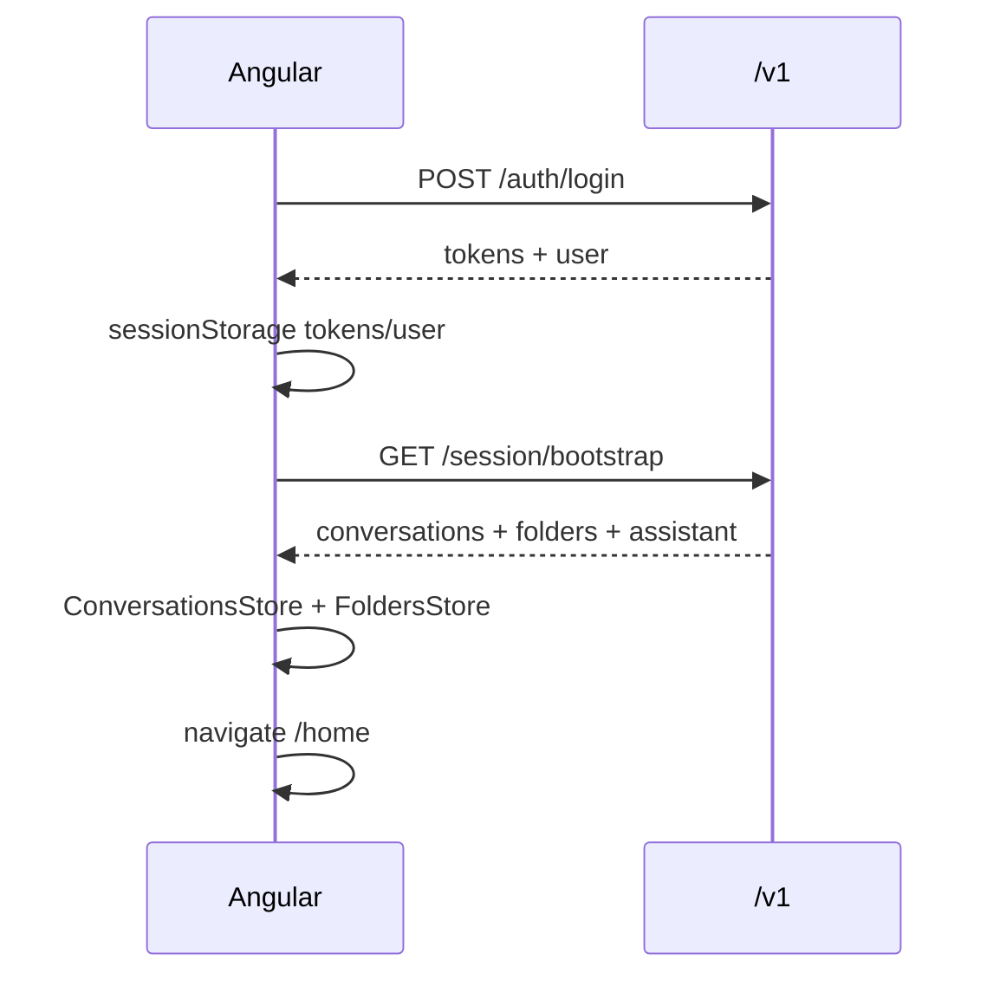

# Guia de integração — Front Angular ↔ Backend TTYD

**Público:** time front (Angular 19 — `talk-to-your-data`)  
**API:** v1 em `/v1`  
**OpenAPI:** `http://localhost:8000/docs`  
**Documentação backend:** [BACKEND.md](./BACKEND.md)

---

## Índice

1. [Configuração inicial](#1-configuração-inicial)
2. [Tipos TypeScript](#2-tipos-typescript)
3. [Autenticação e interceptor](#3-autenticação-e-interceptor)
4. [Serviços Angular (sugestão)](#4-serviços-angular-sugestão)
5. [Mapa tela → endpoint](#5-mapa-tela--endpoint)
6. [Fluxos da UI](#6-fluxos-da-ui)
7. [Chat síncrono vs streaming (SSE)](#7-chat-síncrono-vs-streaming-sse)
8. [Paginação e datas](#8-paginação-e-datas)
9. [Tratamento de erros](#9-tratamento-de-erros)
10. [Regras importantes](#10-regras-importantes)
11. [Ambiente de desenvolvimento](#11-ambiente-de-desenvolvimento)
12. [Checklist de integração](#12-checklist-de-integração)
13. [Integração SAML AD Record](#13-integração-saml-ad-record)

---

## 1. Configuração inicial

### 1.1 `environment.ts`

```typescript
export const environment = {
  production: false,
  apiBaseUrl: 'http://localhost:8000/v1',
  chatStreaming: true, // true → POST .../messages/stream
};
```

| Ambiente | `apiBaseUrl` (exemplo) |
|----------|-------------------------|
| Dev local | `http://localhost:8000/v1` |
| Docker dev | `http://localhost:8000/v1` |
| Homologação | `https://api-hml.ttyd.record.local/v1` |
| Produção | `https://api.ttyd.record.com/v1` |

### 1.2 Headers em todas as requisições autenticadas

```typescript
const headers = {
  'Content-Type': 'application/json',
  Accept: 'application/json',
  Authorization: `Bearer ${accessToken}`,
  'X-Request-Id': crypto.randomUUID(), // recomendado
};
```

Para **streaming**, use `Accept: text/event-stream` apenas na rota de stream.

### 1.3 CORS

O backend já envia `Access-Control-Allow-Origin: *`. Em produção, alinhar com o domínio do front.

---

## 2. Tipos TypeScript

Copie para `src/app/core/api/api.types.ts` (ou gere via OpenAPI: `http://localhost:8000/openapi.json`).

```typescript
// --- Erro padrão ---
export interface ApiErrorDetail {
  field?: string;
  message: string;
}

export interface ApiErrorBody {
  error: {
    code: string;
    message: string;
    details: ApiErrorDetail[];
    requestId: string;
  };
}

// --- Auth ---
export interface AuthTokens {
  accessToken: string;
  refreshToken: string;
  expiresIn: number;
  tokenType: 'Bearer';
}

export interface User {
  id: string;
  username: string;
  displayName: string;
  email: string | null;
  roles: string[];
  tenantId: string | null;
}

export interface LoginRequest {
  username: string;
  password: string;
}

export interface LoginResponse {
  tokens: AuthTokens;
  user: User;
}

// --- Paginação ---
export interface PaginationMeta {
  page: number;
  pageSize: number;
  totalItems: number;
  totalPages: number;
  hasNext: boolean;
  hasPrevious: boolean;
}

export interface PaginatedResponse<T> {
  data: T[];
  pagination: PaginationMeta;
}

// --- Conversa ---
export interface ConversationSummary {
  id: string;
  title: string;
  description: string | null;
  lastUpdatedAt: number; // epoch ms
  folderId: string | null;
}

export interface CreateConversationRequest {
  title?: string;
  folderId?: string | null;
}

export interface PatchConversationRequest {
  title?: string;
  folderId?: string | null;
}

// --- Mensagem ---
export type MessageRole = 'user' | 'assistant';
export type MessageFeedback = 'like' | 'dislike' | null;

export interface ChatMessage {
  id: string;
  conversationId: string;
  role: MessageRole;
  content: string;
  createdAt: number; // epoch ms
  status?: 'pending' | 'completed' | 'failed';
  feedback?: MessageFeedback;
}

export interface SendMessageRequest {
  content: string;
}

export interface SendMessageResponse {
  conversation: ConversationSummary;
  userMessage: ChatMessage;
  assistantMessage: ChatMessage;
}

export interface WithMessageRequest {
  content: string;
  folderId?: string | null;
}

export interface WithMessageResponse {
  conversation: ConversationSummary;
  userMessage: ChatMessage;
  assistantMessage: ChatMessage;
}

// --- Pasta ---
export interface Folder {
  id: string;
  name: string;
  slug: string;
  createdAt?: number;
  updatedAt?: number;
  conversationsCount?: number;
}

export interface FoldersListResponse {
  data: Folder[];
}

// --- Bootstrap ---
export interface BootstrapResponse {
  user: User;
  conversations: PaginatedResponse<ConversationSummary>;
  folders: FoldersListResponse;
  assistant: { displayName: string };
}

// --- Feedback ---
export interface FeedbackRequest {
  feedback: 'like' | 'dislike' | null;
}

export interface FeedbackResponse {
  messageId: string;
  feedback: MessageFeedback;
  updatedAt: number;
}

// --- SSE ---
export type SseEventType =
  | 'user_message'
  | 'assistant_start'
  | 'assistant_delta'
  | 'assistant_done'
  | 'conversation_updated'
  | 'error';

export interface SseUserMessagePayload {
  message: ChatMessage;
}

export interface SseAssistantStartPayload {
  messageId: string;
  conversationId: string;
}

export interface SseAssistantDeltaPayload {
  messageId: string;
  delta: string;
}

export interface SseAssistantDonePayload {
  message: ChatMessage;
}

export interface SseConversationUpdatedPayload {
  conversation: ConversationSummary;
}

export interface SseErrorPayload {
  code: string;
  message: string;
}
```

### Códigos de erro (`error.code`)

| Código | HTTP | Ação sugerida no front |
|--------|------|------------------------|
| `AUTH_INVALID_CREDENTIALS` | 401 | Exibir `error.message` no login |
| `AUTH_TOKEN_EXPIRED` | 401 | Tentar refresh; se falhar → logout + `/` |
| `CONVERSATION_NOT_FOUND` | 404 | Toast + limpar conversa ativa |
| `FOLDER_NOT_FOUND` | 404 | Toast pasta não encontrada |
| `FOLDER_DUPLICATE_NAME` | 409 | Mensagem do modal criar pasta |
| `VALIDATION_ERROR` | 422 | `details[0].message` ou `message` |
| `CHAT_RATE_LIMIT` | 429 | Toast aguarde (`retryAfter` em details) |
| `LLM_UNAVAILABLE` | 503 | Toast serviço indisponível |

---

## 3. Autenticação e interceptor

### 3.1 Onde persistir tokens

| Dado | Sugestão |
|------|----------|
| `accessToken` | Memória + `sessionStorage` |
| `refreshToken` | `sessionStorage` (ou httpOnly cookie se o backend evoluir) |
| `user` | `sessionStorage` ou signal/store para sidebar |

**Não** use IDs locais (`conv-1739...`) após integração — somente UUIDs da API.

### 3.2 Fluxo de login

```typescript
// auth.service.ts (exemplo)
login(username: string, password: string): Observable<LoginResponse> {
  return this.http.post<LoginResponse>(`${environment.apiBaseUrl}/auth/login`, {
    username: username.trim(),
    password, // sem trim na senha
  });
}
```

Após sucesso:

1. Salvar `tokens` e `user`
2. `router.navigateByUrl('/home')`
3. Chamar `GET /session/bootstrap` (ou hidratar stores em paralelo)

### 3.3 Interceptor HTTP (esboço)

```typescript
@Injectable()
export class AuthInterceptor implements HttpInterceptor {
  intercept(req: HttpRequest<unknown>, next: HttpHandler): Observable<HttpEvent<unknown>> {
    const token = this.auth.getAccessToken();
    let cloned = req;

    if (token && !req.url.includes('/auth/login') && !req.url.includes('/auth/refresh')) {
      cloned = req.clone({
        setHeaders: {
          Authorization: `Bearer ${token}`,
          'X-Request-Id': crypto.randomUUID(),
        },
      });
    }

    return next.handle(cloned).pipe(
      catchError((err: HttpErrorResponse) => {
        const body = err.error as ApiErrorBody | undefined;
        if (err.status === 401 && body?.error?.code === 'AUTH_TOKEN_EXPIRED') {
          return this.auth.refreshAndRetry(cloned, next);
        }
        return throwError(() => err);
      }),
    );
  }
}
```

### 3.4 Refresh

```typescript
refresh(): Observable<AuthTokens> {
  const refreshToken = this.getRefreshToken();
  return this.http
    .post<{ tokens: AuthTokens }>(`${environment.apiBaseUrl}/auth/refresh`, { refreshToken })
    .pipe(map((r) => r.tokens));
}
```

### 3.5 Logout

```typescript
logout(): Observable<void> {
  const refreshToken = this.getRefreshToken();
  return this.http
    .post(`${environment.apiBaseUrl}/auth/logout`, { refreshToken })
    .pipe(
      finalize(() => {
        this.clearSession();
        this.router.navigateByUrl('/');
      }),
    );
}
```

Chamar `clearSession()` mesmo se a rede falhar.

---

## 4. Serviços Angular (sugestão)

Estrutura recomendada:

```text
src/app/core/api/
  api.types.ts
  auth-api.service.ts
  session-api.service.ts
  conversations-api.service.ts
  messages-api.service.ts
  folders-api.service.ts
  chat-stream.service.ts      # SSE com fetch ou EventSource polyfill
```

### 4.1 URLs base

```typescript
@Injectable({ providedIn: 'root' })
export class ApiConfig {
  readonly base = environment.apiBaseUrl;

  auth = {
    login: () => `${this.base}/auth/login`,
    refresh: () => `${this.base}/auth/refresh`,
    logout: () => `${this.base}/auth/logout`,
  };

  session = {
    bootstrap: () => `${this.base}/session/bootstrap`,
  };

  users = {
    me: () => `${this.base}/users/me`,
  };

  conversations = {
    list: () => `${this.base}/conversations`,
    create: () => `${this.base}/conversations`,
    withMessage: () => `${this.base}/conversations/with-message`,
    one: (id: string) => `${this.base}/conversations/${id}`,
    messages: (id: string) => `${this.base}/conversations/${id}/messages`,
    stream: (id: string) => `${this.base}/conversations/${id}/messages/stream`,
    regenerate: (convId: string, msgId: string) =>
      `${this.base}/conversations/${convId}/messages/${msgId}/regenerate`,
    export: (id: string, format: 'txt' | 'pdf' = 'txt') =>
      `${this.base}/conversations/${id}/export?format=${format}`,
  };

  folders = {
    list: () => `${this.base}/folders`,
    one: (id: string) => `${this.base}/folders/${id}`,
    bySlug: (slug: string) => `${this.base}/folders/by-slug/${slug}`,
    create: () => `${this.base}/folders`,
  };

  messages = {
    feedback: (messageId: string) => `${this.base}/messages/${messageId}/feedback`,
  };
}
```

### 4.2 Exemplos de chamadas

```typescript
// Bootstrap após login
getBootstrap(page = 1, pageSize = 50): Observable<BootstrapResponse> {
  return this.http.get<BootstrapResponse>(this.urls.session.bootstrap(), {
    params: { page, pageSize, sort: 'lastUpdatedAt', order: 'desc' },
  });
}

// Listar conversas (sidebar / pesq-conversas)
listConversations(params: {
  page?: number;
  pageSize?: number;
  q?: string;
  folderId?: string | null;
}): Observable<PaginatedResponse<ConversationSummary>> {
  const httpParams: Record<string, string> = {
    page: String(params.page ?? 1),
    pageSize: String(params.pageSize ?? 50),
    sort: 'lastUpdatedAt',
    order: 'desc',
  };
  if (params.q) httpParams['q'] = params.q;
  if (params.folderId === null) httpParams['folderId'] = 'null';
  else if (params.folderId) httpParams['folderId'] = params.folderId;

  return this.http.get<PaginatedResponse<ConversationSummary>>(
    this.urls.conversations.list(),
    { params: httpParams },
  );
}

// Enviar mensagem (síncrono)
sendMessage(conversationId: string, content: string): Observable<SendMessageResponse> {
  return this.http.post<SendMessageResponse>(
    this.urls.conversations.messages(conversationId),
    { content: content.trim() },
  );
}

// Primeira pergunta sem conversa aberta
createWithMessage(content: string, folderId?: string | null): Observable<WithMessageResponse> {
  return this.http.post<WithMessageResponse>(this.urls.conversations.withMessage(), {
    content: content.trim(),
    folderId: folderId ?? null,
  });
}
```

---

## 5. Mapa tela → endpoint

| Tela / componente | Ação | Método | Path |
|-------------------|------|--------|------|
| `LoginComponent` | Entrar | POST | `/auth/login` |
| App / guard | Renovar token | POST | `/auth/refresh` |
| `HomeComponent` | Logout | POST | `/auth/logout` |
| `/home` (init) | Carga inicial | GET | `/session/bootstrap` |
| Sidebar | Listar conversas | GET | `/conversations` |
| `HomeComponent` | Nova conversa vazia | POST | `/conversations` |
| Sidebar | Abrir conversa | GET | `/conversations/{id}/messages` |
| Modal renomear | Renomear | PATCH | `/conversations/{id}` `{ title }` |
| Mover para pasta | Mover | PATCH | `/conversations/{id}` `{ folderId }` |
| Excluir conversa | DELETE | DELETE | `/conversations/{id}` |
| `HomeChatComponent` | Primeira pergunta (sem conv) | POST | `/conversations/with-message` |
| `HomeChatComponent` | Enviar mensagem | POST | `/conversations/{id}/messages` |
| `HomeChatComponent` | Streaming | POST | `/conversations/{id}/messages/stream` |
| `HomeChatComponent` | Regenerar | POST | `/conversations/{id}/messages/{mid}/regenerate` |
| Like/dislike | PUT | `/messages/{id}/feedback` |
| Exportar | GET | `/conversations/{id}/export?format=txt` |
| `PesqConversasComponent` | Buscar | GET | `/conversations?q=` |
| `PastasComponent` | Listar pastas | GET | `/folders` |
| Modal criar pasta | POST | `/folders` |
| Renomear pasta | PATCH | `/folders/{id}` |
| Excluir pasta | DELETE | `/folders/{id}?cascade=true` |
| `DentroPastaComponent` | Abrir pasta | GET | `/folders/{id}` ou `/folders/by-slug/{slug}` |
| `DentroPastaComponent` | Conversas da pasta | GET | `/conversations?folderId={id}` |

---

## 6. Fluxos da UI

### 6.1 Login → Home



**Store:** substituir mocks por `bootstrap.conversations.data` e `bootstrap.folders.data`.  
`user.displayName` → sidebar.  
`assistant.displayName` → export PDF/TXT.

### 6.2 Primeira pergunta (sem `currentConversationId`)

```typescript
// conversations.store.ts — após integração
sendFirstMessage(content: string): void {
  this.api.createWithMessage(content).subscribe({
    next: (res) => {
      this.upsertConversation(res.conversation);
      this.setMessages(res.conversation.id, [res.userMessage, res.assistantMessage]);
      this.selectConversation(res.conversation.id);
    },
    error: (err) => this.handleApiError(err),
  });
}
```

**Regra:** `conversation.description` = primeira pergunta; não atualizar em mensagens seguintes.

### 6.3 Pergunta em conversa existente

```typescript
sendMessage(conversationId: string, content: string): void {
  const trimmed = content.trim();
  if (!trimmed) return;

  if (environment.chatStreaming) {
    this.chatStream.stream(conversationId, trimmed).subscribe(/* ver §7 */);
  } else {
    this.api.sendMessage(conversationId, trimmed).subscribe({
      next: (res) => {
        this.appendMessages(conversationId, res.userMessage, res.assistantMessage);
        this.upsertConversation(res.conversation);
      },
    });
  }
}
```

**UI durante request:** desabilitar composer; texto tipo “RecordAI está respondendo...”.

### 6.4 Nova conversa vazia (“Nova conversa”)

```typescript
newConversation(): void {
  this.api.createConversation({ title: 'Novo chat', folderId: null }).subscribe({
    next: (conv) => {
      this.upsertConversation(conv);
      this.selectConversation(conv.id);
      this.clearMessages(conv.id);
      this.router.navigate(['/home']);
    },
  });
}
```

### 6.5 Criar pasta e mover conversa

```typescript
createFolderAndMaybeMove(name: string, conversationId?: string): void {
  this.foldersApi.create(name.trim()).subscribe({
    next: (folder) => {
      this.foldersStore.add(folder);
      if (conversationId) {
        this.patchConversation(conversationId, { folderId: folder.id });
      }
    },
    error: (err) => {
      if (err.error?.error?.code === 'FOLDER_DUPLICATE_NAME') {
        this.showError('Não foi possível criar a pasta (nome inválido ou duplicado).');
      }
    },
  });
}
```

### 6.6 Abrir pasta por rota `/home/pastas/:id`

`:id` pode ser **UUID** ou **slug**:

```typescript
resolveFolder(idOrSlug: string): Observable<Folder> {
  const isUuid = /^[0-9a-f-]{36}$/i.test(idOrSlug);
  return isUuid
    ? this.http.get<Folder>(this.urls.folders.one(idOrSlug))
    : this.http.get<Folder>(this.urls.folders.bySlug(idOrSlug));
}
```

---

## 7. Chat síncrono vs streaming (SSE)

### 7.1 Síncrono — `POST /conversations/{id}/messages`

- **Status:** `201`
- **Body:** `SendMessageResponse` com `conversation`, `userMessage`, `assistantMessage` completos
- Substituir mock + `setTimeout(350ms)`

### 7.2 Streaming — `POST /conversations/{id}/messages/stream`

- **Response:** `200`, `Content-Type: text/event-stream`
- **Importante:** `HttpClient` do Angular **não** parseia SSE nativamente. Use `fetch` com `ReadableStream` ou biblioteca (`@microsoft/fetch-event-source`).

Exemplo com **fetch**:

```typescript
async streamMessage(
  conversationId: string,
  content: string,
  handlers: {
    onUserMessage: (m: ChatMessage) => void;
    onAssistantStart: (p: SseAssistantStartPayload) => void;
    onDelta: (p: SseAssistantDeltaPayload) => void;
    onDone: (m: ChatMessage) => void;
    onConversationUpdated: (c: ConversationSummary) => void;
    onError: (p: SseErrorPayload) => void;
  },
): Promise<void> {
  const token = this.auth.getAccessToken();
  const res = await fetch(this.urls.conversations.stream(conversationId), {
    method: 'POST',
    headers: {
      'Content-Type': 'application/json',
      Accept: 'text/event-stream',
      Authorization: `Bearer ${token}`,
    },
    body: JSON.stringify({ content: content.trim() }),
  });

  if (!res.ok) {
    const err = await res.json();
    throw err;
  }

  const reader = res.body!.getReader();
  const decoder = new TextDecoder();
  let buffer = '';

  while (true) {
    const { done, value } = await reader.read();
    if (done) break;
    buffer += decoder.decode(value, { stream: true });
    const blocks = buffer.split('\n\n');
    buffer = blocks.pop() ?? '';

    for (const block of blocks) {
      const lines = block.split('\n');
      let event = '';
      let data = '';
      for (const line of lines) {
        if (line.startsWith('event:')) event = line.slice(6).trim();
        if (line.startsWith('data:')) data = line.slice(5).trim();
      }
      if (!event || !data) continue;
      const parsed = JSON.parse(data);
      switch (event as SseEventType) {
        case 'user_message':
          handlers.onUserMessage(parsed.message);
          break;
        case 'assistant_start':
          handlers.onAssistantStart(parsed);
          break;
        case 'assistant_delta':
          handlers.onDelta(parsed);
          break;
        case 'assistant_done':
          handlers.onDone(parsed.message);
          break;
        case 'conversation_updated':
          handlers.onConversationUpdated(parsed.conversation);
          break;
        case 'error':
          handlers.onError(parsed);
          break;
      }
    }
  }
}
```

**UI streaming:**

1. `user_message` → append bolha usuário  
2. `assistant_start` → criar bolha assistente vazia (`status: pending`)  
3. `assistant_delta` → concatenar `delta` no conteúdo  
4. `assistant_done` → finalizar (`status: completed`)  
5. `conversation_updated` → atualizar sidebar (`title`, `lastUpdatedAt`)

---

## 8. Paginação e datas

### 8.1 Paginação

Listagens retornam:

```json
{
  "data": [],
  "pagination": {
    "page": 1,
    "pageSize": 50,
    "totalItems": 128,
    "totalPages": 3,
    "hasNext": true,
    "hasPrevious": false
  }
}
```

Query params: `page`, `pageSize` (máx. 100), `sort`, `order`.

### 8.2 Datas

| Campo API | Tipo | Exibição UI |
|-----------|------|-------------|
| `lastUpdatedAt`, `createdAt`, `updatedAt` | **number** (epoch ms) | `new Date(ms).toLocaleString('pt-BR')` |

Helper:

```typescript
export function formatApiDate(epochMs: number): string {
  return new Date(epochMs).toLocaleString('pt-BR');
}
```

---

## 9. Tratamento de erros

```typescript
handleApiError(err: HttpErrorResponse): void {
  const body = err.error as ApiErrorBody | undefined;
  const code = body?.error?.code;
  const message = body?.error?.message ?? 'Erro inesperado.';

  switch (code) {
    case 'AUTH_INVALID_CREDENTIALS':
      this.loginError = message;
      break;
    case 'AUTH_TOKEN_EXPIRED':
      this.auth.logout();
      break;
    case 'FOLDER_DUPLICATE_NAME':
      this.toast.error('Não foi possível criar a pasta (nome inválido ou duplicado).');
      break;
    case 'CHAT_RATE_LIMIT':
      this.toast.warn(message);
      break;
    case 'LLM_UNAVAILABLE':
      this.toast.error('O assistente está temporariamente indisponível.');
      break;
    case 'VALIDATION_ERROR':
      this.toast.error(body?.error?.details?.[0]?.message ?? message);
      break;
    default:
      this.toast.error(message);
  }
}
```

---

## 10. Regras importantes

| # | Regra |
|---|--------|
| 1 | Usar **somente IDs UUID** retornados pela API |
| 2 | `description` da conversa = **primeira pergunta**; não sobrescrever depois |
| 3 | Validar `title` / `name` / `content` com `trim()` **antes** de chamar API |
| 4 | Título vazio no rename → não chamar API; mostrar “Informe o nome da conversa.” |
| 5 | Feedback só em mensagens `role === 'assistant'` |
| 6 | Usuário `ttyd:user` vê métricas em `%`; `ttyd:admin` vê valores brutos (camada backend, ver [BACKEND.md §15](./BACKEND.md#15-pipeline-llm-guardrails-e-apresentação-por-role)) |
| 6 | `toggle feedback` com mesmo valor → enviar `{ feedback: null }` |
| 7 | Regenerar só em mensagem assistente |
| 8 | Ordenar sidebar por `lastUpdatedAt` **desc** |
| 9 | Mensagens no chat por `createdAt` **asc** (`order=asc` na API) |
| 10 | Export PDF retorna `501` — usar `format=txt` ou manter export client-side |

---

## 11. Ambiente de desenvolvimento

### Subir o backend

```bash
make up
# ou
make dev
```

### Credenciais seed (`DEV_OFFLINE=true`)

| Campo | Valor |
|-------|--------|
| Usuário | `adminrecord` |
| Senha | `record123` |
| Display name | `Diego` |

### Testar sem o Angular

```bash
./scripts/test_api_v1.sh
```

### Proxy Angular (`proxy.conf.json`) — opcional

Evita CORS em dev se mudar origem:

```json
{
  "/v1": {
    "target": "http://localhost:8000",
    "secure": false,
    "changeOrigin": true
  }
}
```

`environment.apiBaseUrl = '/v1'`

### Gerar cliente a partir do OpenAPI

```bash
npx openapi-typescript http://localhost:8000/openapi.json -o src/app/core/api/openapi.d.ts
```

---

## 11.1 Substituir mocks no front

| Mock atual | Substituir por |
|------------|----------------|
| `USER_NAME` / usuário fixo | `bootstrap.user.displayName` ou `users/me` |
| `ConversationsStore` seed | `bootstrap.conversations.data` + CRUD API |
| `FoldersStore` seed | `bootstrap.folders.data` + CRUD API |
| Resposta fixa + delay no chat | `sendMessage` ou `streamMessage` |
| IDs `conv-*`, `seed-*` | UUID da API |

---

## 12. Checklist de integração

### Autenticação
- [ ] `POST /auth/login` integrado no `LoginComponent`
- [ ] Tokens em `sessionStorage` + interceptor Bearer
- [ ] `POST /auth/refresh` no interceptor (401 `AUTH_TOKEN_EXPIRED`)
- [ ] `POST /auth/logout` no botão sair

### Sessão inicial
- [ ] `GET /session/bootstrap` ao entrar em `/home`
- [ ] Stores hidratados com resposta da API

### Conversas
- [ ] Listagem sidebar com paginação
- [ ] Criar conversa vazia
- [ ] `with-message` na primeira pergunta
- [ ] Carregar mensagens ao selecionar conversa
- [ ] Renomear / mover / excluir

### Chat
- [ ] Envio síncrono ou SSE conforme `environment.chatStreaming`
- [ ] Regenerar mensagem assistente
- [ ] Estados `pending` / `completed` na UI

### Pastas
- [ ] CRUD pastas
- [ ] Rota por slug
- [ ] `DELETE ?cascade=true`
- [ ] Erro 409 nome duplicado

### Extras
- [ ] Feedback like/dislike
- [ ] Busca `q` em conversas e pastas
- [ ] Export TXT (opcional)
- [ ] Tratamento centralizado de `ApiErrorBody`

---

## 13. Integração SAML AD Record

SAML 2.0 com Microsoft Entra ID (padrão ContentAI). **Login local permanece** (`POST /v1/auth/login`).

Documentação completa: [SAML_AD_RECORD.md](./SAML_AD_RECORD.md)

### Rotas SAML (públicas)

| Método | URL (recomendado front) | Descrição |
|--------|-------------------------|-----------|
| GET | `/api/auth/saml/login` | Redirect para Entra ID |
| POST | `/api/auth/saml/callback` | Callback IdP (navegador) |
| GET | `/api/auth/saml/metadata` | XML SP para TI Record |

Equivalente v1: `/v1/auth/saml/*`

### Botão na tela de login

```html
<button type="button" class="btn-microsoft" (click)="loginWithMicrosoft()">
  Entrar com Microsoft
</button>
<span class="divider">ou</span>
<!-- formulário username/password existente -->
```

```typescript
loginWithMicrosoft(): void {
  window.location.href = '/api/auth/saml/login';
}
```

Use **mesma origem** do backend ou proxy em dev (`proxy.conf.json` → `/api` → `localhost:8000`).

### Retorno do Entra — capturar tokens na URL

Após SSO, o backend redireciona para:

```
{APP_AUTH_SAML_FRONTEND_LOGIN_URL}?token={accessToken}&refresh={refreshToken}
```

Ex.: `http://localhost:4200/login?token=eyJ...&refresh=...`

```typescript
// login.component.ts
ngOnInit(): void {
  const token = this.route.snapshot.queryParamMap.get('token');
  const refresh = this.route.snapshot.queryParamMap.get('refresh');
  if (token) {
    this.authService.persistTokens(token, refresh ?? undefined);
    this.router.navigateByUrl('/home', { replaceUrl: true });
    return;
  }
  // fluxo login local normal...
}
```

`persistTokens` deve ser o **mesmo** usado após `POST /auth/login` (access + refresh JWT TTYD).

### Fluxo combinado na login

```mermaid
flowchart LR
  A[Login local] --> B[POST /v1/auth/login]
  C[Entrar com Microsoft] --> D[GET /api/auth/saml/login]
  D --> E[Entra ID]
  E --> F[POST callback backend]
  F --> G["/login?token&refresh"]
  G --> H[/home + bootstrap]
  B --> H
```

### Erros SAML (via redirect ou página de erro)

Se o callback falhar antes do redirect, o front pode receber query `?error=...` (evolução futura). Hoje erros no callback retornam JSON `4xx` — tratar em página de erro genérica se necessário.

| `error.code` | Situação |
|--------------|----------|
| `AUTH_SAML_DISABLED` | SAML off (404 no login) |
| `AUTH_SAML_INVALID_RESPONSE` | Resposta IdP inválida |
| `AUTH_SAML_PROVISION_DISABLED` | Usuário não cadastrado e sem auto-provision |
| `AUTH_ACCOUNT_INACTIVE` | Conta desativada |

### Checklist SAML (front)

- [ ] Botão "Entrar com Microsoft" → `/api/auth/saml/login`
- [ ] Captura `token` + `refresh` em `/login`
- [ ] Mesmo `TokenService` / interceptor que login local
- [ ] `GET /session/bootstrap` após SSO
- [ ] Login local **não** alterado
- [ ] SLO não implementado — logout só `POST /auth/logout` local

---

## Documentos relacionados

| Documento | Conteúdo |
|-----------|----------|
| [SAML_AD_RECORD.md](./SAML_AD_RECORD.md) | SAML IdP/SP, env, Entra, provisionamento |
| [BACKEND.md](./BACKEND.md) | Arquitetura, entidades, DynamoDB, curl |
| [API_V1.md](./API_V1.md) | Lista rápida de endpoints |
| `http://localhost:8000/docs` | Swagger interativo |

---

*TTYD — integração front Angular 19 com API v1.*
