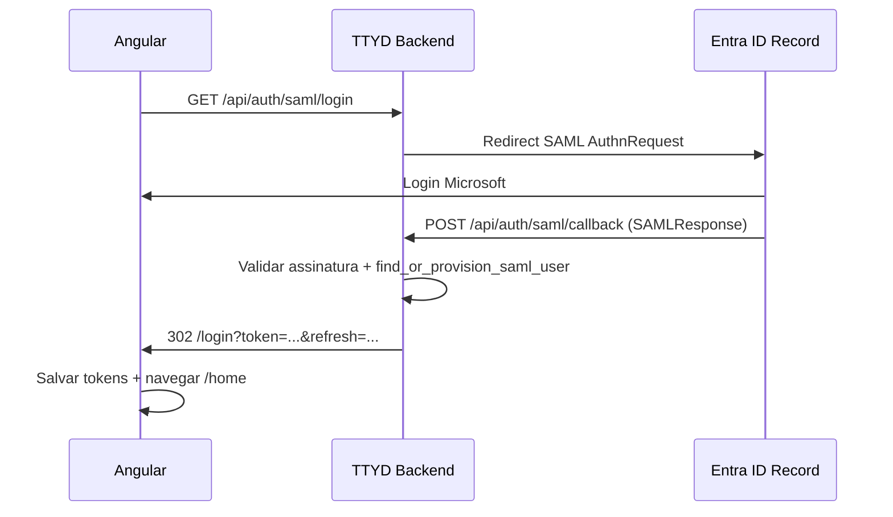

# SAML 2.0 — Integração AD Record (Microsoft Entra ID)

Alinhado ao padrão **ContentAI**: Record/Entra como **IdP**, TTYD como **SP**, login local preservado em paralelo.

---

## Visão geral

| Papel | Sistema |
|-------|---------|
| Identity Provider (IdP) | Microsoft Entra ID — Record |
| Service Provider (SP) | Talk to Your Data (TTYD) |
| Login local | `POST /v1/auth/login` (inalterado) |
| Login corporativo | SAML 2.0 (novo, em paralelo) |

**SLO (Single Logout):** não implementado nesta fase.

---

## Rotas

| Método | Path v1 | Path compat ContentAI | Auth |
|--------|---------|----------------------|------|
| GET | `/v1/auth/saml/login` | `/api/auth/saml/login` | Público |
| POST | `/v1/auth/saml/callback` | `/api/auth/saml/callback` | Público |
| GET | `/v1/auth/saml/metadata` | `/api/auth/saml/metadata` | Público |

Com `APP_AUTH_SAML_ENABLED=false`, login e metadata retornam **404** `AUTH_SAML_DISABLED`.

---

## Testar AD sem Entra Record (dev mock)

Para validar o **mesmo fluxo do front** (botão Microsoft → redirect → `/login?token=...`) **antes** da prod Record:

| Variável | Valor |
|----------|--------|
| `DEV_OFFLINE` | `true` |
| `APP_AUTH_SAML_ENABLED` | `true` |
| `APP_AUTH_SAML_DEV_MOCK` | `true` |
| `APP_AUTH_SAML_AUTO_PROVISION` | `true` |
| `APP_AUTH_SAML_FRONTEND_LOGIN_URL` | `http://localhost:4200/login` |

Opcional: `APP_AUTH_SAML_MOCK_EMAIL`, `APP_AUTH_SAML_MOCK_DISPLAY_NAME`.

**Comportamento:** `GET /api/auth/saml/login` **não** abre o Entra; provisiona usuário SSO (`auth_provider=microsoft`, `ad_oid=email`) e redireciona ao front com tokens — igual ao callback real.

**Segurança:** o mock só atua se `DEV_OFFLINE=true` (não funciona em prod/AWS real).

```bash
# security/.env.dev — após make env-dev, ajuste as flags acima
poetry run uvicorn backend.main:app --reload --env-file security/.env.dev --port 8000
```

No navegador: http://localhost:8000/api/auth/saml/login  
Ou o botão **Entrar com Microsoft** no Angular.

---

## Fluxo



---

## Variáveis de ambiente

### SAML (novas)

| Variável | Descrição |
|----------|-----------|
| `APP_AUTH_SAML_ENABLED` | `true` ativa SAML |
| `APP_AUTH_SAML_SP_ENTITY_ID` | Entity ID do SP (metadata) |
| `APP_AUTH_SAML_SP_ACS_URL` | Assertion Consumer Service (callback) |
| `APP_AUTH_SAML_SP_SLO_URL` | Opcional; SLO não implementado |
| `APP_AUTH_SAML_IDP_ENTITY_ID` | Entity ID do IdP Record |
| `APP_AUTH_SAML_IDP_SSO_URL` | URL SSO do Entra |
| `APP_AUTH_SAML_IDP_CERT` | Certificado X.509 IdP (com ou sem PEM headers) |
| `APP_AUTH_SAML_AUTO_PROVISION` | Criar usuário automaticamente no primeiro login |
| `APP_AUTH_SAML_DEFAULT_ROLE` | Role inicial (ex.: `ttyd:user`) |
| `APP_AUTH_SAML_NAME_ID_FORMAT` | Formato NameID (email) |
| `APP_AUTH_SAML_FRONTEND_LOGIN_URL` | Redirect pós-login (ex.: `http://localhost:4200/login`) |

### Microsoft OAuth legado (preservadas)

Não removidas nem renomeadas:

- `ENTRA_TENANT_ID`, `ENTRA_CLIENT_ID`, `ENTRA_CLIENT_SECRET`, `ENTRA_REDIRECT_URI`
- `APP_AUTH_MICROSOFT_TENANT_ID`, `APP_AUTH_MICROSOFT_CLIENT_ID`, `APP_AUTH_MICROSOFT_CLIENT_SECRET`

Usadas por `backend/core/auth_entra.py` (MSAL OAuth). Fluxo **separado** do SAML.

---

## Provisionamento de usuário

Função: `auth_service.find_or_provision_saml_user()`

1. Busca por `ad_oid` = `name_id` SAML  
2. `auth_provider = "microsoft"`  
3. Usuário inativo → **403** `AUTH_ACCOUNT_INACTIVE`  
4. Não existe + auto-provision off → **403** `AUTH_SAML_PROVISION_DISABLED`  
5. Não existe + auto-provision on → cria usuário:
   - Sem senha local utilizável (`__SSO_NO_PASSWORD__`)
   - `must_change_password = false`
   - `is_active = true`
   - `role = APP_AUTH_SAML_DEFAULT_ROLE`

Usuários SSO **não** podem usar `POST /v1/auth/login` com senha.

---

## Validação SAML

Em `backend/services/saml_service.py`:

- `wantAssertionsSigned: true`
- `wantMessagesSigned: true`
- Certificado IdP normalizado (PEM) internamente

Claims extraídas: `name_id`, `email`, `displayName`, `givenName`, `surname`, `userPrincipalName`.

---

## Configuração no Entra ID (Record)

Registrar TTYD como Enterprise Application SAML.

**Produção (exemplo):**

| Campo | URL |
|-------|-----|
| Entity ID | `https://record.ttyd.example.com/v1/auth/saml/metadata` |
| ACS / Reply URL | `https://record.ttyd.example.com/v1/auth/saml/callback` |
| Sign-on URL | `https://record.ttyd.example.com/v1/auth/saml/login` |

**NameID format:** `urn:oasis:names:tc:SAML:1.1:nameid-format:emailAddress`

**Claims:** email, displayName, givenName, surname, userPrincipalName

A Record deve fornecer: Federation Metadata, IdP Entity ID, SSO URL, certificado X.509.

---

## Front Angular

Ver [FRONTEND_INTEGRATION.md](./FRONTEND_INTEGRATION.md#integração-saml-ad-record).

Botão **Entrar com Microsoft**:

```typescript
loginWithMicrosoft(): void {
  window.location.href = '/api/auth/saml/login';
}
```

Callback na rota `/login`:

```typescript
ngOnInit(): void {
  const token = this.route.snapshot.queryParamMap.get('token');
  const refresh = this.route.snapshot.queryParamMap.get('refresh');
  if (token) {
    this.tokenService.setTokens(token, refresh);
    this.router.navigate(['/home'], { replaceUrl: true });
  }
}
```

---

## Dependências

```
python3-saml>=1.16.0
lxml>=4.9.0
```

---

## Arquivos implementados

| Arquivo | Função |
|---------|--------|
| `backend/app_config/settings.py` | Variáveis SAML + ENTRA preservadas |
| `backend/services/saml_service.py` | Config SAML, login URL, callback, metadata |
| `backend/services/auth_service.py` | `find_or_provision_saml_user`, tokens |
| `backend/api/v1/routes/saml.py` | Rotas HTTP |
| `backend/main.py` | Mirror `/api/auth/saml/*` |
| `backend/infrastructure/persistence/*` | `ad_oid`, `auth_provider`, provisionamento |

---

*Documentação técnica backend: [BACKEND.md](./BACKEND.md)*
